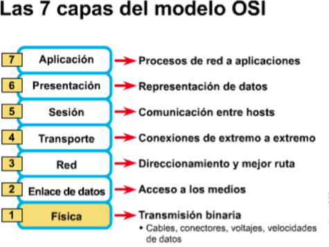
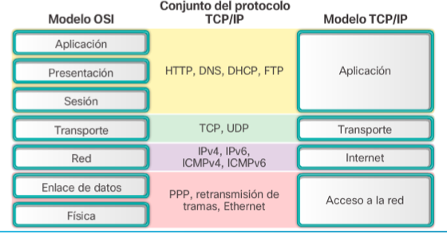
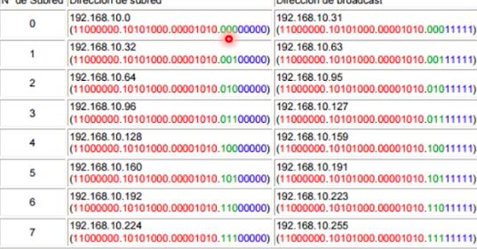

# Clase 2
## Repaso OSI

## Protocolo ARP
Traduce a:

    address resolution protocol
    
### Funciones

- relaciona la ip con la MAC 
- trabaja en la capa de red (osi) o internet (tcp/ip)
- cada equipo tiene su tabla ARP

### ¿cómo funciona?

- Cuando no conoces a nadie te presentas a todo el mundo (Broadcast)
- Luego solo te contesta a quien va dirigido el mensaje y entablas una conversación. (en este momento se genera la tabla ARP)
- Cuando quieres hablar con una persona específica, te diriges a ella específicamente.

## Direccionamiento en ipv4

### Broadcast en ipv4
- la parte de host debe estar en 255

### Broadcast en MAC
- FF:FF:FF...

** investigar lo de ip dhcp pool, como se usan varias pools..
** tambien saber si el dns se auto-excluyen

## Subnetting

### ¿Por qué hacer subnetting?
- por un lado optimiza el recurso ipv4
- hace parte de la seguridad de la red 
- poque para que dos ip se puedan ver deben ser parte de una misma red 

## Método

### Ejercicio
Dada una red:
	
	 192.168.10.0
     255.255.255.0
     
obtener 8 subredes.

1. Calcular el número de bits necesarios para codificar las n subredes

Recordemos que `2^{n} = # de subredes`. Donde n son los bits necesarios.
Para obtener los bits necesarios bastaría 

    \log_{2}{8}= 3.

2. Obtener nuestra submáscara de red

Como necesitamos 3 bits. Se los añadimos a nuestra submáscara primaria, lo que produciría:

        11111111.11111111.11111111.00000000   // mascara primaria
        11111111.11111111.11111111.11100000   // nuestra submáscar`
                                   ---+++++
        ---: bits de red
        +++: bits de host

Es decir nuestra máscara de subred sería `255.255.255.224`.

3. ¿Cuántas ip se pueden generar en cada una de las 8 redes?

Como contamos con 5 bits de red, disponemos de 2^{5} posibilidades.
No obstante, recordemos que tenemos que restarle la *ip de red* y la *ip de broadcast*. Por lo que las ip válidas serían:

	2^{n} - 2

En nuestro caso, tendriamos 30 ips validas en cada una de nuestras 8 redes.

4. Cálculo de subredes

